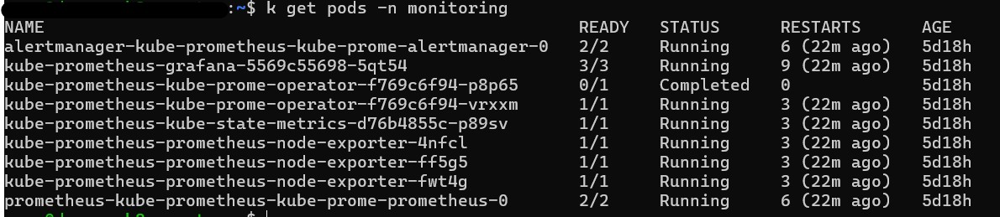
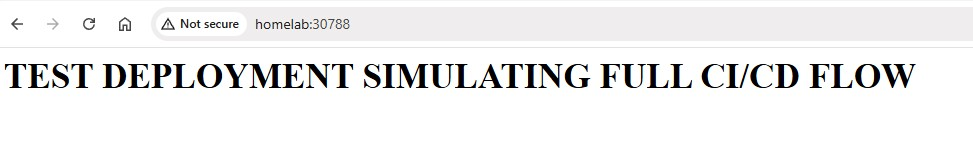
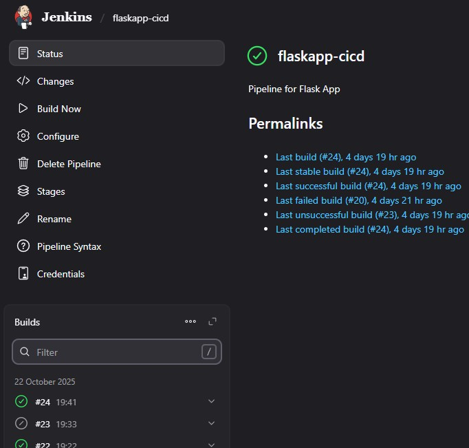
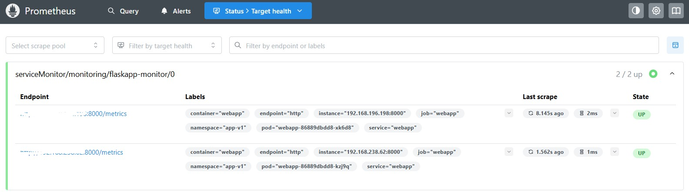
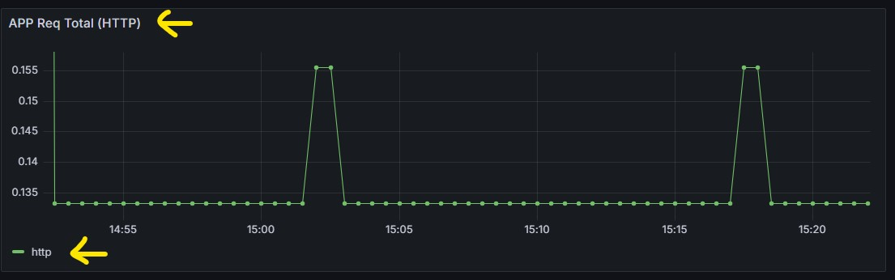

# 🚀 Home Lab - CI/CD, Kubernetes & Monitoring

## 📘 Overview

This project demonstrates a complete **DevOps CI/CD pipeline** using a simple **Flask-based web application** deployed on a **Kubernetes cluster**.  

It covers key DevOps lifecycle components — **source control, build automation, containerization, orchestration, monitoring, and observability** — all running locally within a **fully functional home lab environment**.

The setup also emphasizes **High Availability (HA)**, **Disaster Recovery (DR)**, and **Service Reliability**, reflecting real-world enterprise **DevOps** and **Site Reliability Engineering (SRE)** practices.  

In future phases, the architecture will expand to include **multi-zone / multi-region cloud deployment** and **safe deployment strategies** such as **Blue-Green** and **Canary releases** to ensure zero-downtime updates.

---


## 🧩 Project Architecture

## 🧰 Tech Stack & Tools Used

| Category | Tool | Purpose |
|-----------|------|----------|
| **Source Control** | GitHub | Hosts application and IaC repositories |
| **CI/CD Automation** | Jenkins | Automates build, test, and deploy pipeline |
| **Containerization** | Docker | Packages the Flask app and dependencies |
| **Orchestration** | Kubernetes | Deploys and manages application containers |
| **Configuration Management** | Ansible | Automates environment setup across VMs |
| **Infrastructure as Code (IaC)** | Terraform |  Automates VM and cluster provisioning |
| **Code Quality & Scanning** | SonarQube | Static code analysis integrated into CI |
| **Artifact Registry** | DockerHub | Stores and versions container images |
| **Monitoring & Metrics** | Prometheus | Collects metrics from Kubernetes and applications |
| **Visualization & Dashboards** | Grafana | Visualizes performance and reliability metrics |
| **Reverse Proxy & Load Balancing** | NGINX  | Provides ingress and routing for web traffic |
| **Programming Language** | Python | Simple web app used for demonstration |

---


## 🏗️ High-Level Architecture & CI/CD Flow

This setup represents a **real-world DevOps pipeline** — from code commit to deployment and monitoring — running entirely inside a **AWS Kubernetes cluster**.


<pre>         
           │   Developer    │
           │   (Git Push)   │
           └──────┬─────────┘
                  │
                  ▼
        ┌────────────────────────────┐
        │        GitHub Repo         │
        │ (Source + Jenkinsfiles +   │
        │  Terraform + Ansible Code) │
        └──────────┬────────────────┘
                   │ Webhook Trigger
                   ▼
        ┌────────────────────────────┐
        │          Jenkins           │
        │     CI/CD Orchestrator     │
        ├────────────────────────────┤
        │                            │
        │ 1️⃣ Infra Pipeline (IaC)     │
        │  ─────────────────────────  │
        │  • Terraform → AWS Infra    │
        │  • Ansible → K8s Cluster    │
        │  • Triggers App Pipeline    │
        │                            │
        │ 2️⃣ App Deployment Pipeline │
        │  ─────────────────────────  │
        │  • Build Docker Image       │
        │  • Run Unit Tests           │
        │  • Push to Docker Hub       │
        │  • Deploy via Ansible + K8s │
        └──────────┬────────────────┘
                   │
                   ▼
        ┌─────────────────────┐
        │     Docker Hub      │
        │ (Container Images)  │
        └──────── ┬───────────┘
                  │
                  ▼
        ┌─────────────────────┐
        │   Kubernetes (K8s)  │
        │  (App Deployment)   │
        └────────┬────────────┘
                 │
                 ▼
        ┌─────────────────────┐
        │   Prometheus +      │
        │     Grafana         │
        │ (Monitoring Stack)  │
        └─────────────────────┘
 ``` </pre>
---

## ☁️ Phase 0 - Infrastructure as Code (IaC)

Before deploying any applications, the foundation infrastructure was fully automated using **Terraform** and **Ansible**, executed through a **Jenkins pipeline**.


### ✅ Provision AWS Resources with Terraform

- Creates EC2 instances for master and worker nodes.
- Configures networking, security groups, and SSH access.
- Outputs public IPs for dynamic inventory generation.


### ⚙️ Configure Kubernetes with Ansible

- Automatically installs and initializes Kubernetes on the master node.
- Joins worker nodes to the cluster.
- Sets up required namespaces, metrics server, and ingress controller.

### 🚀 Jenkins Automation

- The Jenkinsfile-infra pipeline handles both Terraform and Ansible execution.
- Includes a DESTROY_INFRA parameter to optionally tear down AWS resources.
- When successful, it triggers the app deployment pipeline automatically.


--- 

## 🏗️ Phase 1 - Flask App Setup

- Built a simple Python Flask application with `/` and `/metrics` endpoints.
- Added a `requirements.txt` file for dependencies.
- Verified the app runs locally using:
  ```bash
  python main.py
  ```
- Confirmed `/metrics` exposes Prometheus-style metrics for monitoring.

---


## 🐳 Phase 2 - Dockerization

- Created a `Dockerfile`:
  ```dockerfile
  FROM python:3.10-slim
  WORKDIR /app
  COPY requirements.txt .
  RUN pip install --no-cache-dir -r requirements.txt
  COPY . .
  EXPOSE 8000
  CMD ["python", "main.py"]
  ```

- Built and tested the container:
  ```bash
  docker build -t flask-app .
  docker run -p 8000:8000 flask-app
  ```

---


## ☸️ Phase 3 - Kubernetes Deployment

- Deployed the Flask app to Kubernetes with a **Deployment**, **Service**, and **Ingress**.
- Example manifest:
  ```yaml
  apiVersion: apps/v1
  kind: Deployment
  metadata:
    name: webapp
    namespace: app-v1
  spec:
    replicas: 4
  
  ```
  **K8S Running Pods:**

  

 **Verified the app via: http://homelab:30788**




---


## 🔁 Phase 4 - CI/CD with Jenkins

- Configured **Jenkins** with:
  - Git plugin
  - Docker plugin
  - Kubernetes CLI
  - Credentials for Docker Hub and kubeconfig
- Jenkins automatically:
  1. Pulls code from GitHub on push  
  2. Builds the Docker image  
  3. Pushes it to Docker Hub  
  4. Updates the Kubernetes deployment with the new image tag  
  5. Rolls out the new version automatically

**Jenkinsfile:**
```groovy
pipeline {
    agent any
    environment {
        DOCKERHUB_CREDENTIALS = credentials('dockerhub-creds')
        KUBECONFIG_CREDENTIALS = credentials('kubeconfig-file')
    }

    stages {
        stage('Checkout') {
            steps {
                git branch: 'main', url: 'https://github.com/angsgit/devops_project.git'
            }
```

**Jenkins Pipeline:**



---


## 📊 Phase 5 - Monitoring & Observability

- Installed **Helm**:
  ```bash
  curl https://raw.githubusercontent.com/helm/helm/main/scripts/get-helm-3 | bash
  ```
- Added the Prometheus community repo and installed the monitoring stack:
  ```bash
  helm repo add prometheus-community https://prometheus-community.github.io/helm-charts  
  helm install kube-prometheus prometheus-community/kube-prometheus-stack -n monitoring
  ```
- Exposed Grafana to the host:
  ```bash
  kubectl -n monitoring patch svc kube-prometheus-grafana -p '{"spec": {"type": "NodePort"}}'
  kubectl -n monitoring get svc kube-prometheus-grafana
  ```
  → Accessed Grafana via `http://<master-node-ip>:<nodeport>`

**Prometheus scraping Metrics:**




**Grafana Visualising Metrics:**


**Custom Dashboard in Grafana for APP Metrics (HTTP Total Requests):**



---

## ☁️ Phase 5 - Disaster Recovery (DR)

To ensure high availability and resilience, a Disaster Recovery (DR) strategy was integrated into the AWS DevOps pipeline.  
All components — infrastructure, configuration, and applications — are reproducible using Infrastructure as Code (IaC).

---

### 🧩 Multi-Region Infrastructure-as-Code

- The Terraform configuration supports **multi-region deployment** by parameterizing the AWS region.
- Jenkins can deploy to either the **primary** or **secondary (DR)** AWS region.

```hcl

variable "aws_region" {
  default = "eu-west-1"  # Primary region
}

provider "aws" {
  region = var.aws_region
}
Deploy to the DR region:

terraform apply -var="aws_region=eu-central-1"

---

### 🪄 Automated Backup & Restore

### **Kubernetes Cluster State**
- Implemented **Velero** to back up namespaces, deployments, and services to Amazon S3.  
- Velero can restore these resources to a DR cluster in another region.

```bash
velero backup create full-cluster-backup --include-namespaces app-v1
velero restore create --from-backup full-cluster-backup


## 🧠 Key Learnings

- End-to-End DevOps Pipeline: Built a complete CI/CD workflow — from source code in GitHub to application deployment on Kubernetes.
- Infrastructure as Code (IaC): Automated AWS infrastructure provisioning using Terraform, followed by Ansible for Kubernetes setup and configuration.
- Jenkins Automation: Used Jenkins pipelines triggered by Git webhooks to orchestrate both infrastructure creation and application deployment.
- Containerization & Deployment: Dockerized a Flask application, pushed the image to Docker Hub, and deployed it to Kubernetes clusters using Ansible playbooks.
- Kubernetes Management: Gained experience managing manifests, namespaces, services, and ingress controllers in Kubernetes.
- Monitoring & Observability: Deployed Prometheus and Grafana (via Helm charts) for real-time metrics collection and visualization.
- Cluster Operations: Learned to handle node taints, resource requests/limits, and pod scheduling for better reliability and resource utilization.

---


## 🗺️ Next Steps (Planned)

- Integrate Alertmanager notifications (Slack or email) 
- Deploy to a cloud-managed Kubernetes cluster (EKS / AKS)

---


## 📂 Repository Structure

```
.
project/
│
├── README.md                           # Full project documentation and setup guide
├── .gitignore                          # Ignore unnecessary files (logs, creds, etc.)
│
├── app/                                # Flask application source code
│   ├── main.py                         # Flask entry point
│   ├── requirements.txt                # Python dependencies
│   ├── Dockerfile                      # Container build instructions
│
├── IaC/                                # Infrastructure as Code (Terraform + Ansible)
│   ├── terraform/                      # Terraform for AWS infrastructure
│   │   ├── main.tf                     # EC2 instances, security groups, networking
│   │   ├── variables.tf                # Input variables
│   │   ├── outputs.tf                  # Exported IPs for Ansible inventory
│   │   ├── provider.tf                 # AWS provider and backend configuration
│   │   └── terraform.tfstate           # Terraform state file (generated)
│   │
│   ├── ansible/                        # Ansible playbooks for configuration & deployment
│   │   ├── install_kubernetes.yml      # Installs Kubernetes on AWS EC2 instances
│   │   ├── deploy_k8s_app.yml          # Deploys Flask app to Kubernetes cluster
│   │   ├── inventory.ini               # Dynamic inventory generated from Terraform outputs
│   │   └── roles/                      # (Optional) Future modularization for Ansible roles
│   │
│   └── Jenkinsfile-infra               # Jenkins pipeline for provisioning & setup
│
├── jenkins/                            # Jenkins CI/CD pipeline configuration
│   ├── Jenkinsfile-app-deploy          # Pipeline for build → push → deploy (App)
│
├── k8s/                                # Kubernetes manifests and Helm resources
│   ├── webappv1.yaml                   # Deployment, Service, and Ingress for the Flask app
│   ├── namespace.yaml                  # Custom namespace definition (e.g. app-v1)
│   ├── helm/                           # Helm charts for monitoring stack
│   │   ├── prometheus/
│   │   └── grafana/
│
├── monitoring/                         # Monitoring stack (Helm-based)
│   ├── prometheus/                     # Prometheus custom configurations
│   ├── grafana/                        # Grafana dashboards and custom configs
│   │   ├── dashboards/
│   │   └── datasources/
│
└── documentation/                      # Documentation and visuals
    ├── architecture_diagram.png        # Jenkins → Terraform → Ansible → K8s pipeline
    ├── screenshots/                    # Grafana dashboards, Jenkins UI, Flask app views
    │   ├── grafana-dashboard.png
    │   ├── jenkins-pipeline.png
    │   └── flask-app.png
    └── notes.md                        # Summary notes, troubleshooting logs, future plans


```

---


## 🔒 Security

All sensitive credentials and configuration files (e.g. Docker Hub tokens, kubeconfig, Grafana admin passwords) are **not stored in this repository**.  
They are securely managed using **Jenkins Credentials**, **Kubernetes Secrets**, or **local environment variables**.

This project follows **DevSecOps best practices**, ensuring:
- No hardcoded passwords, API keys, or tokens are present in source control.
- Jenkins pipelines use credential IDs only (not plaintext secrets).
- Sensitive cluster configurations (like kubeconfig) remain private and stored securely on the control node.
- Public documentation and manifests contain only non-sensitive example values.

---


---

## 👤 Author
**Angad Singh**  
DevOps & Cybersecurity Engineer  
[GitHub: angsgit](https://github.com/angsgit)
