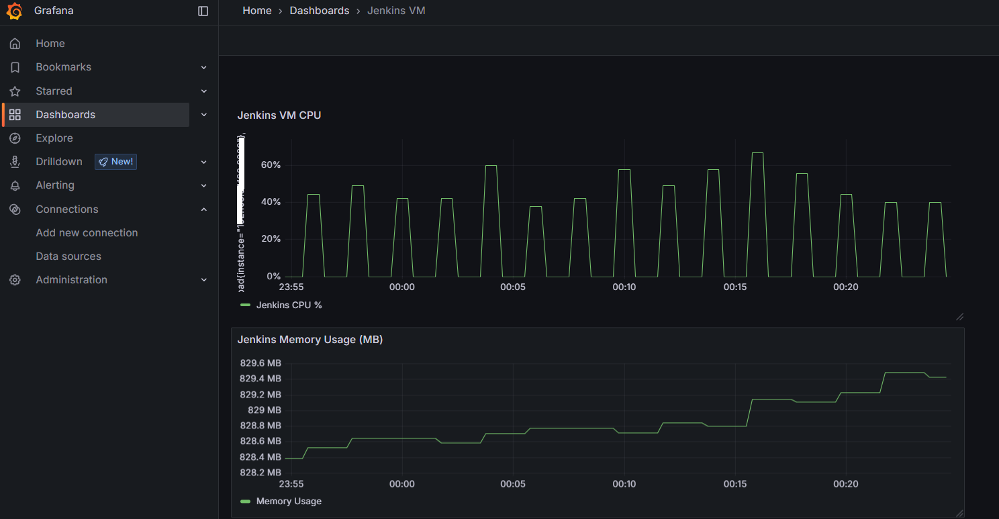
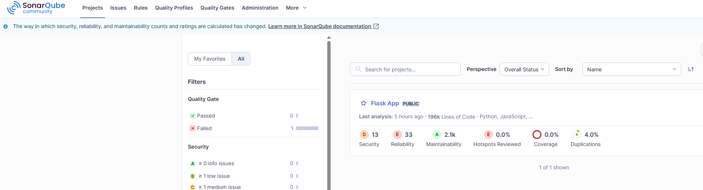
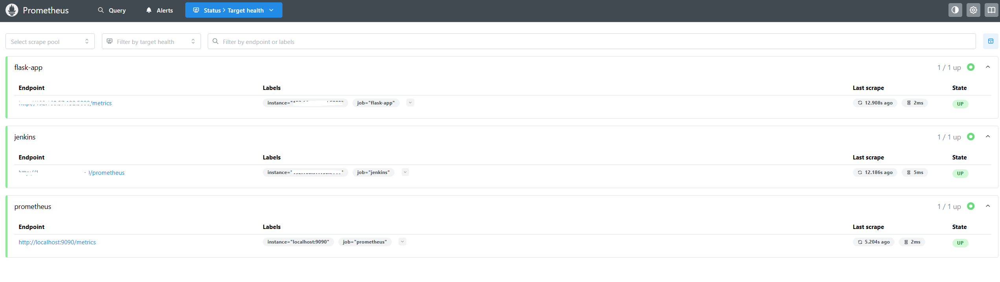
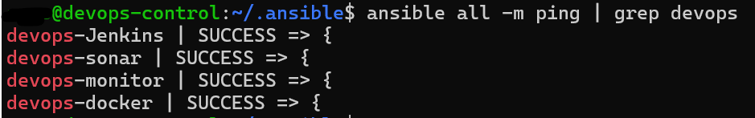

*********************************************************************************************************
# 🧪 DevOps Homelab TL;DR
  
A personal DevOps lab built on VMware using Multiple VMs, each with a dedicated role in the DevOps lifecycle. Everything is automated using Ansible from a central control node. All VM's hosted locally on an Vmware ESXi Host.

## 💻 VMs & Services

devops-control: Ansible controller
devops-git: Gitea + MySQL (Git server)
devops-jenkins: Jenkins (CI/CD)
devops-sonar: SonarQube + PostgreSQL (code quality)
devops-monitor: Prometheus + Grafana (monitoring)
devops-docker: Container registry
devops-k8s: (planned) Kubernetes cluster
devops-nginx: (planned) Reverse proxy/load balancer

---
## 📸 Screenshots

## 🧪 Jenkins Pipeline Execution
### Automated pipeline runs on code push:

Pulls code from Gitea
Runs tests (e.g. pytest)
Performs static code analysis using SonarQube
Triggers deployment via Ansible

---
## 📊 Grafana Dashboard
### Visualized metrics for:

Flask app performance
Jenkins resource usage
System health

---
## 🧪 SonarQube Dashboard

SonarQube is integrated into the Jenkins pipeline to perform static code analysis after tests are run. It helps track code quality, bugs, and vulnerabilities.

---
## 📈 Prometheus Monitoring
### All service metrics are scraped via Prometheus with jobs set for:

Flask app
Jenkins
Prometheus itself

---
## 🔧 🔁 Ansible Connectivity
### Verified connectivity from the Ansible control node to all DevOps VMs using the ping module:

---
## 🌐 Networking

All VMs use a private NAT network with static IPs (redacted in public docs).

---
## ⚙️ Automation

Ansible handles configuration and deployment from the control node.

---
## 🚧 Next Steps

Add Nexus/Harbor, Kubernetes, CI pipelines, and Nginx routing.

*********************************************************************************************************

# 🧪 Full DevOps Homelab Setup

This document outlines the architecture, services, and current state of a personal DevOps homelab designed for hands-on learning, experimentation, and automation using.

---

## 📌 Overview

The homelab simulates a real-world DevOps environment with dedicated virtual machines for source control, CI/CD, static code analysis, monitoring, container registry, and more. All VMs run on a local VMware host, using an isolated virtual network.

---

## 🧱 Virtual Machine Inventory

| VM Name          | IP Address     |    Role / Services                               | Status           |
|------------------|----------------|--------------------------------------------------|------------------|
| `devops-control` | `Redacted`     | Ansible controller                               | ✅ Configured    |
| `devops-git`     | `Redacted`     | Gitea + MySQL (source control)                   | ✅ Configured    |
| `devops-jenkins` | `Redacted`     | Jenkins (CI/CD pipeline)                         | ✅ Configured    |
| `devops-sonar`   | `Redacted`     | SonarQube + PostgreSQL (code quality)            | ✅ Configured    |
| `devops-docker`  | `Redacted`     | Planned: Container registry (e.g., Nexus/Harbor) | ✅ Configured    |
| `devops-k8s`     | `Redacted`     | Planned: Kubernetes cluster                      | ⏳ Pending       |
| `devops-monitor` | `Redacted`     | Prometheus + Grafana (monitoring)                | ✅ Configured    |
| `devops-nginx`   | `Redacted`     | Planned: Reverse proxy / load balancer (Nginx)   | ⏳ Pending       |

---

## ⚙️ Services Setup Summary

### Ansible Control Node (`devops-control`)
- Installed Ansible.
- SSH keys configured for passwordless access to all other VMs.
- Verified using `ansible all -m ping`.

### Gitea Git Server (`devops-git`)
- Installed Gitea using Ansible.
- MySQL backend configured for Gitea.
- Web UI is accessible.

### Jenkins (`devops-jenkins`)
- Installed Jenkins via Ansible.
- Accessible via web login interface.

### SonarQube (`devops-sonar`)
- Installed SonarQube.
- Local PostgreSQL configured and integrated.
- Web UI is accessible.

### Monitoring (`devops-monitor`)
- Prometheus installed and scraping targets.
- Grafana installed and accessible.
- Ready for dashboard creation.

---

## 🧑‍💻 Networking

- All VMs run on an isolated NAT network in VMware Workstation.
- Static IPs are manually assigned and referenced internally via placeholder variables.
- DNS handled locally or via `/etc/hosts` entries.

---

## 🔁 Automation with Ansible

- **Control VM** uses Ansible over SSH to remotely deploy on seperate VM's:
  - Install and configure Gitea and MySQL.
  - Deploy Jenkins and plugins.
  - Deploy Docker.
  - Deploy & configure Sonarcube.
  - Deploy & configure Prometheus/Grafana.
- Inventory defined in `/etc/ansible/hosts`.

---

## 🧭 Next Steps

- [ ] Set up a container registry on `devops-docker` (e.g., Nexus or Harbor).
- [ ] Deploy a basic Kubernetes cluster on `devops-k8s`.
- [ ] Set up `devops-nginx` as a reverse proxy to expose internal services.
- [ ] Add CI/CD pipelines in Jenkins.
- [ ] Add Prometheus targets and Grafana dashboards for all services.
- [ ] Improve Ansible roles for modular and reusable configurations.

---

## 🛠️ Troubleshooting Tips

- Use `ansible -m ping all` to verify VM connectivity.
- Jenkins initial password: check `/var/lib/jenkins/secrets/initialAdminPassword`.
- Gitea logs: `/var/lib/gitea/log/`, MySQL logs: `/var/log/mysql/`.
- SonarQube logs: `/opt/sonarqube/logs/`.

---

## ✍️ Author Notes

- This homelab is part of a learning journey into DevOps and DevSecOps practices.
- Regular updates and improvements are documented in GitHub.
