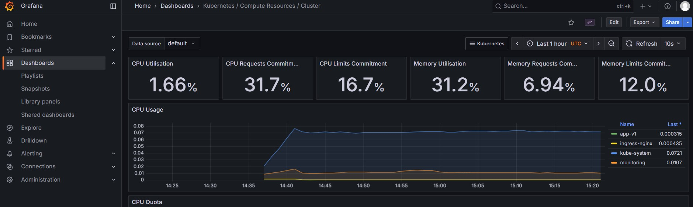

# 🚀 Home Lab - CI/CD, Kubernetes & Monitoring

## 📘 Overview

This project demonstrates a complete **DevOps CI/CD pipeline** using a simple **Flask-based web application** deployed on a **Kubernetes cluster**.  

It covers key DevOps lifecycle components — **source control, build automation, containerization, orchestration, monitoring, and observability** — all running locally within a **fully functional home lab environment**.

The setup also emphasizes **High Availability (HA)**, **Disaster Recovery (DR)**, and **Service Reliability**, reflecting real-world enterprise **DevOps** and **Site Reliability Engineering (SRE)** practices.  

In future phases, the architecture will expand to include **multi-zone / multi-region cloud deployment** and **safe deployment strategies** such as **Blue-Green** and **Canary releases** to ensure zero-downtime updates.

---

## 🧩 Project Architecture

## 🧰 Tech Stack & Tools Used

| Category | Tool | Purpose |
|-----------|------|----------|
| **Source Control** | GitHub | Hosts application and IaC repositories |
| **CI/CD Automation** | Jenkins | Automates build, test, and deploy pipeline |
| **Containerization** | Docker | Packages the Flask app and dependencies |
| **Orchestration** | Kubernetes | Deploys and manages application containers |
| **Configuration Management** | Ansible | Automates environment setup across VMs |
| **Infrastructure as Code (IaC)** | Terraform |  Automates VM and cluster provisioning |
| **Code Quality & Scanning** | SonarQube | Static code analysis integrated into CI |
| **Artifact Registry** | DockerHub | Stores and versions container images |
| **Monitoring & Metrics** | Prometheus | Collects metrics from Kubernetes and applications |
| **Visualization & Dashboards** | Grafana | Visualizes performance and reliability metrics |
| **Reverse Proxy & Load Balancing** | NGINX  | Provides ingress and routing for web traffic |
| **Programming Language** | Python | Simple web app used for demonstration |


---

## 🏗️ High-Level Architecture & CI/CD Flow

This setup represents a **real-world DevOps pipeline** — from code commit to deployment and monitoring — running entirely inside a **local Kubernetes cluster**.

           ┌────────────────┐
           │   Developer    │
           │   (Git Push)   │
           └──────┬─────────┘
                  │
                  ▼
        ┌─────────────────────┐
        │     GitHub Repo     │
        │ (Source + Jenkinsfile)
        └────────┬────────────┘
                 │ Webhook
                 ▼
        ┌─────────────────────┐
        │       Jenkins       │
        │  CI/CD Orchestrator │
        ├─────────────────────┤
        │ Build Docker Image  │
        │ Run Unit Tests      │
        │ Push to Docker Hub  │
        │ Deploy via kubectl  │
        └────────┬────────────┘
                 │
                 ▼
        ┌─────────────────────┐
        │     Docker Hub      │
        │ (Container Images)  │
        └────────┬────────────┘
                 │
                 ▼
        ┌─────────────────────┐
        │   Kubernetes (K8s)  │
        │  (App Deployment)   │
        └────────┬────────────┘
                 │
                 ▼
        ┌─────────────────────┐
        │   Prometheus +      │
        │     Grafana         │
        │ (Monitoring Stack)  │
        └─────────────────────┘


---

## 🏗️ Phase 1 - Flask App Setup

- Built a simple Python Flask application with `/` and `/metrics` endpoints.
- Added a `requirements.txt` file for dependencies.
- Verified the app runs locally using:
  ```bash
  python main.py
  ```
- Confirmed `/metrics` exposes Prometheus-style metrics for monitoring.

---

## 🐳 Phase 2 - Dockerization

- Created a `Dockerfile`:
  ```dockerfile
  FROM python:3.10-slim
  WORKDIR /app
  COPY requirements.txt .
  RUN pip install --no-cache-dir -r requirements.txt
  COPY . .
  EXPOSE 8000
  CMD ["python", "main.py"]
  ```

- Built and tested the container:
  ```bash
  docker build -t flask-app .
  docker run -p 8000:8000 flask-app
  ```

---

## ☸️ Phase 3 - Kubernetes Deployment

- Deployed the Flask app to Kubernetes with a **Deployment**, **Service**, and **Ingress**.
- Example manifest:
  ```yaml
  apiVersion: apps/v1
  kind: Deployment
  metadata:
    name: webapp
    namespace: app-v1
  spec:
    replicas: 4
  
  ```
  **K8S Running Pods:**

  

 **Verified the app via: http://homelab:30788**


---

## 🔁 Phase 4 - CI/CD with Jenkins

- Configured **Jenkins** with:
  - Git plugin
  - Docker plugin
  - Kubernetes CLI
  - Credentials for Docker Hub and kubeconfig
- Jenkins automatically:
  1. Pulls code from GitHub on push  
  2. Builds the Docker image  
  3. Pushes it to Docker Hub  
  4. Updates the Kubernetes deployment with the new image tag  
  5. Rolls out the new version automatically

**Jenkinsfile:**
```groovy
pipeline {
    agent any
    environment {
        DOCKERHUB_CREDENTIALS = credentials('dockerhub-creds')
        KUBECONFIG_CREDENTIALS = credentials('kubeconfig-file')
    }

    stages {
        stage('Checkout') {
            steps {
                git branch: 'main', url: 'https://github.com/angsgit/devops_project.git'
            }
```

**Jenkins Pipeline:**


---

## 📊 Phase 5 - Monitoring & Observability

- Installed **Helm**:
  ```bash
  curl https://raw.githubusercontent.com/helm/helm/main/scripts/get-helm-3 | bash
  ```
- Added the Prometheus community repo and installed the monitoring stack:
  ```bash
  helm repo add prometheus-community https://prometheus-community.github.io/helm-charts  
  helm install kube-prometheus prometheus-community/kube-prometheus-stack -n monitoring
  ```
- Exposed Grafana to the host:
  ```bash
  kubectl -n monitoring patch svc kube-prometheus-grafana -p '{"spec": {"type": "NodePort"}}'
  kubectl -n monitoring get svc kube-prometheus-grafana
  ```
  → Accessed Grafana via `http://<master-node-ip>:<nodeport>`

- **Verified dashboards: Kubernetes cluster, node, and pod metrics working correctly.**




---

## 🧠 Key Learnings

- Full DevOps pipeline integration from code to Kubernetes
- Automating deployments using Jenkins and Git webhooks
- Managing manifests and namespaces in Kubernetes
- Deploying Helm charts for Prometheus & Grafana
- Observability and metrics visualization
- Understanding node taints, resource requests, and pod scheduling

---

## 🗺️ Next Steps (Planned)

- Add custom Grafana dashboards for Flask app metrics  
- Integrate Alertmanager notifications (Slack or email)  
- Manage infrastructure with Terraform (IaC)  
- Deploy to a cloud-managed Kubernetes cluster (EKS / AKS)

---

## 📂 Repository Structure

```
.
project/
|
|
├── README.md                      # Full project documentation and setup guide
├── .gitignore                     # Ignore unnecessary files (logs, creds, etc.)
│
|
├── app/                           # Flask application source code
│   ├── main.py                    # Flask entry point
│   ├── requirements.txt           # Python dependencies
│   ├── Dockerfile                 # Container build instructions
│ 
│
├── jenkins/                       # Jenkins CI/CD pipeline configuration
│   ├── Jenkinsfile                # Pipeline for build → push → deploy to K8s
│   
│  
├── k8s/                           # Kubernetes manifests and Helm resources
│   ├── webappv1.yaml              # Deployment, Service, and Ingress for the Flask app
│   ├── namespace.yaml             # Custom namespace definition (e.g., app-v1)
│   ├── helm/                      # Helm charts for monitoring stack
│   │   └── 
│ 
│
├── monitoring/                    # Monitoring stack (Helm-based)
│   ├── prometheus/                # Prometheus custom configs
│   │   └── .gitkeep
│   ├── grafana/                   # Grafana dashboards and custom configs
│   │   ├── dashboards/
│   │   │   ├── 
│   │   │   └── 
│   │
│
|
├── terraform/                     # Infrastructure as Code (IaC)
│   ├──                     
|
|
├── ansible/                       # Config Automation
│   ├── playbooks/
│   │   ├── 
│   │   └──
│   └── 
│
|
└── documentation/                          # Documentation and screenshots
    ├── architecture_diagram.png   # Overview of Jenkins → DockerHub → K8s pipeline
    ├── screenshots/               # Grafana, Jenkins UI, Flask App
    │   ├── 
    │   ├── 
    │   ├── 
    │   └── 
    └── 

```

---

## 🔒 Security

All sensitive credentials and configuration files (e.g., Docker Hub tokens, kubeconfig, Grafana admin passwords) are **not stored in this repository**.  
They are securely managed using **Jenkins Credentials**, **Kubernetes Secrets**, or **local environment variables**.

This project follows **DevSecOps best practices**, ensuring:
- No hardcoded passwords, API keys, or tokens are present in source control.
- Jenkins pipelines use credential IDs only (not plaintext secrets).
- Sensitive cluster configurations (like kubeconfig) remain private and stored securely on the control node.
- Public documentation and manifests contain only non-sensitive example values.

---


---

## 👤 Author
**Angad Singh**  
DevOps & Cybersecurity Engineer  
[GitHub: angsgit](https://github.com/angsgit)
